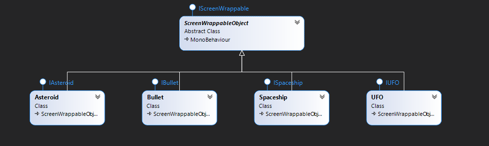
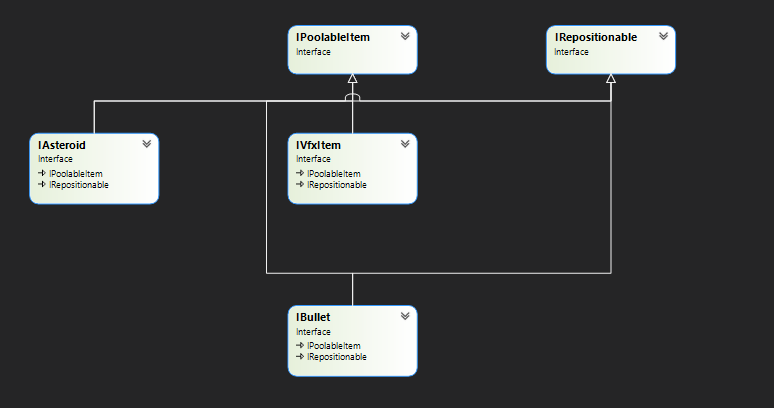
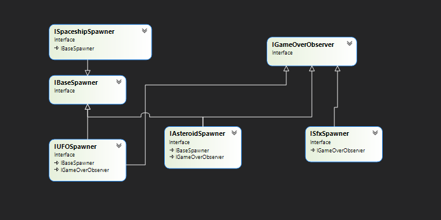

# Atari Asteroids Unity

Notes about various componenets of the game and their interaction.

1. Spaceship
   1. shoot
   2. hyperspace
   3. moves 1 directional
   4. turn
   5. collides with ufo(s), bullet(s) and asteroid(s)
   6. has angular drag and linear drag

2. UFO(s)
   1. shoots in player direction with varying precision
   2. collides with asteroid(s), player bullet(s)
   3. moves across screen
   4. randomize between large and small
   5. has no linear drag

3. Asteroid(s)
   1. collides with divide into smaller asteroids
   2. has 2 level of division
   3. collides with UFO(s), Spaceship, PlayerBullets, EnemyBullets
   4. has no linear/angular drag

4. Bullets(s)
   1. collides with opponent (ufo bullet collides with aspaceship and vice versa)
   2. has lifetime based expiry
   3. has no linear/angular drag

5. Screen Wrapping
   1. objects leaving from an edge enters the screen from the opposite edge

6. Vfx
   1. explosion vfx

7. Sfx
   1. ufo on screen
   2. explosion
   3. shoot

With these points noted. I started on code architecture with the SOLID principle in mind.

**GameObjects:**

- Asteroid
- Bullet
- Spaceship
- UFO
- VfxItem

The following image is the main class struyture that I have implemented for above objects:

**ScreenWrappableObject:** is an abstract base class for all moving game objects on the screen. Any object deriving from this can be screen wrapped and upon initialization automatically adds itself to the wrapping list.

Apart from these and the Vfx explosion gameobject, there are no monobehaviours in the game,since they make testing and constructor dependency injection difficult.

**Screen Wrapping:**

Screen wrapping is one big responsibility and thusI introduced ScreenWrapper class. It isresponsible for screen wrapping-related work. Some points to be noted:

  1. I didn’t want all the objects who wish to screen wrap to actually do it in their `update`. Doing that would be very costly as the number of objects increases.
  2. I didn’t really have to make this class MonoBehaviour. But in order for it to be able to act on `update`, I have delegated this task of updating to GameManager. Thus I worked up a `visitor pattern` implementation for screen wrapper with functions: _Register_, _Unregister_ , _Wrap_ and _Update_.

**Spawners:**

- AsteroidSpawner
- UFOSpawner
- Turret
- VfxSpawner
- SfxSpawner
- SpaceshipSpawner

For bullets, asteroids, vfx and sfx I used a `pooling pattern`. _"After some failing tests andrefactor and more of the same”_, I was able to extracta base class with template param that canbe instantiated with addressable-address for prefab of the objects to be generated.

**Addressables**

Why use Addressables in such a simple game?

1. Addressables make it easier to test. I don’t haveto worry about ways to get a prefabwhile testing.
2. Makes it easier to update the objects in future andprovides designers with the ability tointeract with the system without having to step onthe codebase.
3. Introduces much-desired modularity.

BaseObjectPool class takes in the prefabAddressableKey and the initial pool size and spuns alist of engaged and available items. The template param for the pool requires that the poolableitem should be a monobehaviour and should inheritfrom the interface defined for the poolableitem. This was used for BulletPools, AsteroidPools, and VFXPools.Sfx pooling has a special behavior since it doesn’trequire a gameobject for every free item. The items pooled are of type AudioSource(Component) and are attached to a single gameobject.

The following is an image of poolable item hierarchy:

**Spawner Classes:**

There is a separate category of classes that are responsible for holding a reference to the pool and calling methods for using these pools in the game.These are called Spawner classes. Consider a case for AsteroidSpawner -  Indeed asteroids are pooled in the previously mentioned class system. But the point where they are supposed to load prefab, where they are supposed to spawn, and the level of asteroid to spawn is all kept enclosed in AsteroidSpawner. Spawners don’t always need to have a pool, ratherthey act as an intermediary for othercontaining objects. Thus acting as a **facade**.

**Subsystems:**
- ScreenHandler
- ScreenWrapper
- UIHandler
- GameStatsHandler
- SpaceshipController
- LevelHandler

These are subsystem classes that have the sole responsibility of managing specific aspects ofthe game such as UI, GameStats, level setup, etc. Some of these use read-only struct in their constructor so as to encapsulate the triad/tetrad params. They are not monobehaviour and are thus not attached to a gameobject. They rely on GameManager to be constructed. Whilst GameManager blatantly violates the single responsibility principle, it provides a way to instrument cleaner code using constructor and method dependency injection.

**The case for await/async/delayed operations:** 

At various instances, while working on the game, Ihad to choose a way to implementtime-based delaying calls. Auto expiry, shooting cooldown,etc.List of possible concepts that can be used here:
1. Invoke
2. Coroutine
3. Async Task
   
The first two can only be used with a monobehaviour. And since I have been using classes without monobehaviour, async tasks seemed like a better solution. However, for this game, I chose to go with Coroutines and use a monobehaviour reference passed through constructor for classes that are not monobehaviour. This was due to the boilerplate code associated with setting up async tasks and a similar setup required for cancellation. An async void function has been used in GameStatsHandler.

**Event Bus:**

Since the intention is to avoid code coupling and there were a good number of classes that talk with each other, there was a need to have a way for components to communicate without direct references. Thus Event Bus. _“The only singleton Icould bring myself to use”_.

Lazily instantiated, it provides a framework for components of the system to implement `Observer Pattern`. Thus with subscribe, unsubscribe and publish there was a way to communicate while maintaining weak coupling.

Example:

I didn’t have to add an sfx spawner call for destruction in spaceship code. Spaceship can just publish events stating that the spaceship is destroyed and sfx spawner would handle according to the setup. 

**Keeping Data away from Code:**

There are several scriptable objects in the Data folder that are based on the configs required by a class. Thus, keeping this data available for modification externally by designers. Tweaking stats won’t need someone to tinkle with the code.

**Testing:**

1. NUnit
2. NSubstitute
3. Microsoft.VisualStudio.QualityTools.UnitTestFramework

TDD comes with a peculiar problem, referring to a private method/field/property of an object. Nsubstitute does provide answers for API (public methods)but doesn’t help in setting up testcases from the ground up. C# doesn’t support non-public interface implementationas of now, so in case I can make certain methods of a class into an interface-derived method, I will have to make it available as a public method. This would break the encapsulation and would lead to code being directed by tests. TDD does in a way ask us to write code thinking about tests first but it should not have a direct impact on the code structure. Thus I used the Microsoft library - **Microsoft.VisualStudio.QualityTools.UnitTestFramework**.

It allows access to private methods and fields and properties using reflection on a private object version of the target object. Whilst I prefer using scripts for setting the physics2Dcollision layer, I faced an issue, wherein I realized Physics2DCollisionLayer setup through scripts doesn’t work in test mode. Thus I used the project settings physics 2D collision matrix.
